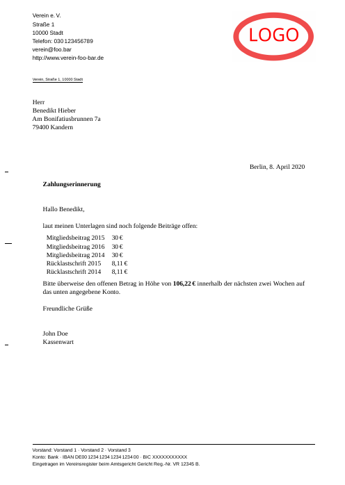

# Worum geht es?

[JVerein][2] ist eine Open-Source-Vereinsverwaltung. Es lassen sich dort jedoch keine schön formatierten Zahlungserinnerungen  erzeugen. 

Mit den Tools in diesem Repository lassen sich aus dem `JVerein` CSV-Export anpassbare, mit LaTex formatierte PDF-Dokumente erzeugen.

## Beispiel



Alle Beispieldaten in diesem Repository sind automatisch generiert und keine 
Adressen existierender Personen.

# Wie funktioniert es

Ein Python Programm (`csv2yaml.py`) generiert aus der CSV Datei `yaml` Daten für jedes Mitglied. Dort werden die Summe der ausstehenden Zahlungen sowie die Übersicht über einzelne Zahlungen abgelegt.

Diese `yaml` Daten werden mit [pandoc][3] in ein PDF-Dokument pro Mitglied konvertiert. `pandoc` nutzt dafür `XeTeX` und zwei Templates. Über die Templates kann Inhalt und Aussehen der Zahlungserinnerung gesteuert werden.


## csv2yaml.py

`csv2yaml.py` ist ein Python Programm welches die CSV parst und für jedes Mitglied eine `yaml` Datei
erzeugt. Diese Datei enthält folgende Felder:

 * `to` (Adresse)
 * `sum` (Gesamtsumme)
 * `opening` (Anrede)
 * `email` (Mailadresse)
 * `position[description,value]` 


`csv2yaml.py` hat zwei Parameter:

* `-c CSV_FILE` Name der CSV-Datei, default `example-export.csv`
* `-o OUTPUT_DIR` Name des Ausgabeverzeichnisses, default `data`


Beispiel Ausgabe:

```yaml
---
"to": |-
  Herr  
  Benedikt Hieber  
  Am Bonifatiusbrunnen 7a  
  79400 Kandern
"sum": |-
  106,22
"opening": |-
  Hallo Benedikt,
"email": |-
  Benedikt Hieber <benedikt.hieber@example.de>
"position":
- "description": |-
    Mitgliedsbeitrag 2015
  "value": |-
    30
- "description": |-
    Mitgliedsbeitrag 2016
  "value": |-
    30
- "description": |-
    Mitgliedsbeitrag 2014
  "value": |-
    30
- "description": |-
    Rücklastschrift 2015
  "value": |-
    8,11
- "description": |-
    Rücklastschrift 2014
  "value": |-
    8,11
...
```

## pandoc

Pandoc wird mit folgenden Parametern aufgerufen:

```bash
pandoc --template=zahlungserinnerung.latex --pdf-engine=xelatex data/Hieber_Benedikt_1.yaml verein.yaml  -o data/Hieber_Benedikt_1.pdf
```

* `--template=zahlungserinnerung.latex` Das LaTeX-Template aus dem `pandoc` mit `xelatex` das PDF generiert.
* `--pdf-engine=xelatex` Benutze `xelatex`
* `data/Hieber_Benedikt_1.yaml` Daten des Mitglieds
* `verein.yaml` Vereinsdaten, Logo, Textbausteine
* `-o data/Hieber_Benedikt_1.pdf` PDF Ausgabe

Das Skript `create_pdf.sh` ruft `pandoc` für jede `yaml`-Datei in `data/` auf.

# Walktrough

Export der ausstehenden Mitgliedsbeiträge aus `JVerein` als CSV.

Erzeugen der `yaml`-Dateien in `data/`.

```bash
./csv2yaml.py -c mahnungen-20161204214455.csv
```

Erzeugen der PDF Dateien in `data/`.
```bash
./create_pdf.sh
```


# Requirements

* XeTex (als Teil von Tex Live)
* Pandoc
* Python
  *  [Tablib][1]
  *  [ruamel.yaml][4]

# Sonstige Dateien

* `din5008frame.tex`: `DIN 5008` Vorlage, kann in `zahlungserinnerung.latex` zur Kontrolle eingebunden werden
* `verein.lco`: Letteroptions, wird über `verein.yaml` in `zahlungserinnerung.latex` eingebunden
* `logo.png`: Logo, wird über `verein.yaml` in `zahlungserinnerung.latex` eingebunden

[1]: http://docs.python-tablib.org/en/master/
[2]: https://jverein.de
[3]: https://pandoc.org/
[4]: https://yaml.readthedocs.io/en/latest/


